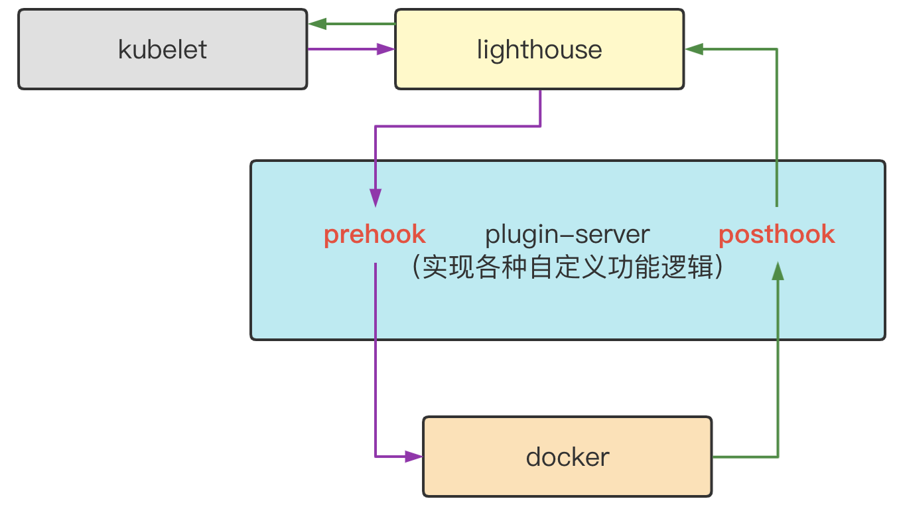

# 编译caelus
（1）编译二进制
```shell
[xx]# make build
[xx]# ll _output/bin/
total 129236
-rwxr-xr-x 1 root root 51634520 Dec 12 16:28 caelus
-rwxr-xr-x 1 root root  6819965 Dec 12 16:28 caelus_metric_adapter
-rwxr-xr-x 1 root root 16416404 Dec 12 16:28 lighthouse
-rwxr-xr-x 1 root root 17624320 Dec 12 16:28 nm-operator
-rwxr-xr-x 1 root root 39832989 Dec 12 16:28 plugin-server

其中
caelus:可通过daemonset部署。实时计算节点空闲资源，并执行离线资源隔离和资源上报。同时通过干扰检测保证在线的服务质量
caelus_metric_adapter:
nm-operator:nodemanager镜像中做为server启动，caelus通过nm-operator暴露的api接口来控制nodemanager进程，如启动、停止和修改yarn-site.xml
lighthouse: 转发kubelet的容器请求到docker
plugin-server: 定向对kubelet发送给docker的容器请求参数做适配，如修改cgroup目录
```


（2）编译caelus镜像
```bash
# 或可以直接下载ccr.ccs.tencentyun.com/caelus/caelus:v1.0.0
make image
```

# 编译lighthouse

```bash
# 编译lighthouse二进制
[xx]# cd contrib/lighthouse
[xx]# make
[xx]# ll _output/bin
_output/bin/lighthouse

# 编译lighthouse rpm包
[xx]# make rpm
[xx]# ll _output/RPMS/x86_64
_output/RPMS/x86_64/lighthouse-0.2.1-47.el7.x86_64.rpm

# 编译plugin-server二进制
[xx]# cd contrib/lighthouse-plugin
[xx]# make
[xx]# ll _output/bin
_output/bin/plugin-server

# 编译plugin-server rpm包
[xx]# make rpm
[xx]# ll _output/RPMS/x86_64
_output/RPMS/x86_64/plugin-server-0.3.0-47.el7.x86_64.rpm
```
lighthouse工作流程



# 安装
### 安装lighthouse
(1) rpm -ivh lighthouse-xxx.rpm

(2) 修改配置参数
```yaml
cat > /etc/lighthouse/config.yaml <<EOF
apiVersion: lighthouse.io/v1alpha1
kind: hookConfiguration
timeout: 10
listenAddress: unix:///var/run/lighthouse.sock
webhooks:
- name: docker
  endpoint: unix://@plugin-server
  failurePolicy: Fail
  stages:
  - urlPattern: /containers/create
    method: post
    type: PreHook
  - urlPattern: /containers/{name:.*}/update
    method: post
    type: PreHook
EOF
```

### 安装plugin-server
(1) rpm -ivh plugin-server-xxx.rpm

(2) 修改配置文件
```yaml
cat > /etc/plugin-server/config <<EOF
ARGS="--feature-gates=DockerUTSMode=true,DockerOfflineMutate=true,DockerPidsLimit=true --v=3 --listen-address=unix://@plugin-server --hostname-override=xxx(node name) --kubeconfig=/xxx"
EOF
```

### 修改kubelet参数
```bash
--docker-endpoint=unix:///var/run/lighthouse.sock --docker=unix:///var/run/lighthouse.sock
```

### 启动服务
```bash
systemctl enable plugin-server
systemctl start plugin-server
systemctl enable lighthouse
systemctl start lighthouse
systemctl restart kubelet

```

# 部署caelus
###配置文件
####1、caelus.json
caelus.json文件描述了caelus内置的各个模块的各种配置，其[默认配置](../hack/config/caelus.json)可以让caelus正常运行，但最好是根据业务的实际需求来适配不同的参数。
具体参数说明可参考[caelus配置文件说明]()

####2、rules.json
rules.json文件描述了caelus的干扰检测规则。如cpu检测，首先配置检测算法，如表达式检测（expression），或指数加权平均检测（ewma）。若选择expression算法，可配置每隔1分钟检测节点cpu使用率，若连续3次超过90%，或连续5分钟内超过90%，则认为节点当前cpu
负载比较高，采取禁止调度，及降低离线cpu资源。降低cpu资源按照每2分钟降低1个核。若节点cpu恢复正常，则按照每3分钟恢复0.5个核，直至恢复所有之前降低的cpu核数。
具体配置参数可参考[干扰检测规则说明](./rules.md)

###运行caelus
caelus可通过daemonset部署到K8s集群中，pod需要配置某些capabilities，同时需要挂载宿主机根目录到caelus容器中，以便cadvisor可以正常运行。
具体yaml可参考[caelus yaml](../hack/yaml/caelus.yaml)

用户也可以根据需求直接将caelus运行在宿主机上，这可以通过rpm包进行部署。其运行命令为：

caelus --v=2 --logtostderr --config=/etc/caelus/caelus.json --hostname-override=$(NODE_NAME) --insecure-bind-address=xx

若使用diskquota功能，则需要再增加：--docker=unix:///var/run/docker.sock，用于跟docker通信，获取容器的挂载目录
# 提交离线作业
1、离线作业通过kubernetes提交

2、离线作业通过YARN提交
